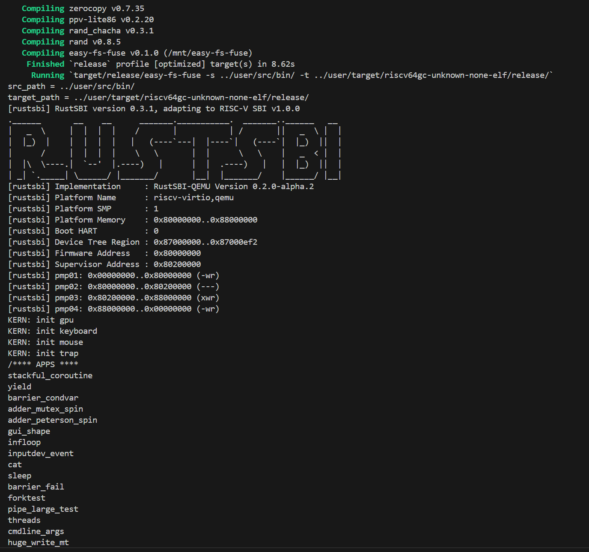

# THU AOS Course Lab: rCore-Tutorial-v3

[[原 README]](README_original.md)

80240442 Advanced Operating System Course Lab, rCore v3.

本实验为清华大学高级操作系统课程作业，参考 [rCore-Tutorial-Book-v3](https://rcore-os.cn/rCore-Tutorial-Book-v3/index.html) 进行学习，Fork 自 [rCore-Tutorial-v3](https://github.com/rcore-os/rCore-Tutorial-v3.git)。

练习里的所有代码均保留在 repo 中。对于“扩展内核”相关的代码练习，修改会直接写在 `os/` 中；对于其它分开的代码，存在根目录下的 `exercise/` 中。代码按照章节分在各个 chX 分支中（切换到对应分支查看，例如 `git switch ch1`）

## 第零章：操作系统概述

环境配置：（推荐）使用 Docker，见：https://rcore-os.cn/rCore-Tutorial-Book-v3/chapter0/5setup-devel-env.html

先登录 root 用户，然后在根目录下执行：

```bash
make build_docker
```

构建估计时间：半小时到一小时。然后平时可以使用如下命令进入容器：

```bash
make docker
```

查看、管理、删除容器同正常 docker 容器。

```bash
docker image ls # rcore-tutorial-v3
docker container ls
docker container rm rcore-tutorial-v3
```

启动容器，编译并在 QEMU 上运行 rCore。构建成功后可以看到可用的 APP 列表，可以运行试试。QEMU 的退出方式：先按 `Ctrl+a`，再按 `x`（如果这个退不了也可以试试直接 `ctrl+c` 或 `ctrl+z` 然后 `kill -9`。
```bash
cd os/
make run
```



Issue: 构建 docker 容器时遇到如下报错

```latex
Step 8/13 : COPY --from=build_qemu /usr/local/bin/* /usr/local/bin
When using COPY with more than one source file, the destination must be a directory and end with a /
make: *** [Makefile:8: build_docker] Error 1
```

- https://github.com/rcore-os/rCore-Tutorial-v3/pull/151
- 解决办法：在 `/usr/local/bin` 后面加一个 `/`

## 第一章：应用程序与基本执行环境

### 应用程序执行环境与平台支持

- 应用程序执行环境：现代操作系统（如 Linux 等）一般都使用多层的执行环境栈，如：应用程序 → (func call) → 标准库 → (sys call) → 内核/OS → (指令集) → 硬件平台。从操作系统的角度来讲，内核上面都属于**用户态**软件，而它自己属于**内核态**。
- 多层执行环境是必须的吗？最上层的应用和最下层的硬件必须存在，除此以外的中间层不必须。它们都是对下层进行了抽象，并且给上层提供了一个执行环境。抽象可以最小化暴露出功能，提供保护，但同时也会丧失灵活性、带来开销。
- 目标平台：现代编译流程是 preprocessor → compiler → assembler → linker。而在不同的平台上生成可执行文件，由于 OS 不同会导致 syscall 调用接口不同；底层硬件不同会导致 ISA 不同。Rust 通过目标三元组（Target Triplet）来描述一个软件的运行平台：CPU、操作系统、运行时库。
    - 例如：调用 `rustc --version --verbose` 可以看到我们的平台是 `x86_64-unknown-linux-gnu`，表示 CPU 架构是 x86_64，操作系统是 linux，运行时库是 GNU libc。
- 我们的主线任务是希望在另一个平台上运行 `Hello world` ，这里我们选择 `riscv64gc-unknown-none-elf` （elf 表示没有运行时库，但可以生成 ELF 格式的执行程序）。因此我们要把我们程序里对 std 库的依赖换成 core 库（core 不需要任何操作系统支持）。
